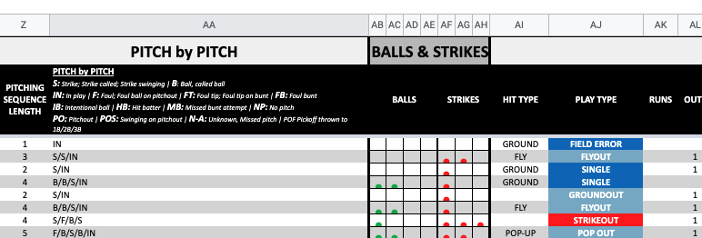

<!-- - [Intro](#intro)
- [Analysis / Data Mining / Planning](#analysis-data-mining-planning)
- [Backend](#backend)
- [Frontend](#frontend)
- [Automation](#automation) -->

## Intro

MLB Game Tracker is a MERN (MongoDB, Express, React, Node.js) project with D3.js for visualizations. This is a project that is many years coming. The inspiration came from a great baseball analytics book called The Book: Playing the Percentages in Baseball. This book covers many topics that are mostly understood by people that follow baseball. Ideas like bunting is almost always a bad idea (same with steals), hot streaks aren't really a thing (neither are cold streaks) and even goes into optimizing your lineup (guess what? The cleanup hitter isn't as important as your little league coach thought). 

Ultimately my goal will be to create a view that allows users to track what the expected runs are for each team compared to the actual number of runs scored. And to give a view into the win probability for each team throughout a game. 

After the site is built, I will work to automate the data export (from bigdataball), data transformation, and data update to MongoDB for the 2021 MLB Season. 

So right now I see this as 4 phases:
1. Analysis / Data Mining / Planning
2. Backend
3. Frontend
4. Automation/Refactor

## Analysis, Data Mining, Planning

This first step of this process was to gather the data and transform it to get the metrics and data points I need. Over the past 2+ years, I have worked to try to find (or scrape) MLB play-by-play data that was free. I have gotten close many times, but I found bigdataball.com and they have play by play data that gets updated each day for a reasonable price (I got 2020 data for ~$35). So I ran with this. The biggest problem with this dataset is that it is an .xlsx file with formatting, so not incredibly machine readable. The two biggest adjustments were transforming the ball and strike columns into 2 ball and strike counter columns and getting rid of any merged cells. After doing that, the file was readable using pandas.read_csv().

Next, I need to add some columns to my datasets. Stuff like runs in current inning and game state (inning + outs + base runners + score difference). I have a Python script that I wrote a couple years ago that I was able to edit and make work for this. It runs pretty slow because I have to calculate the runs till end of inning for each row of data (~190,000 in 2019). I'm planning to go back and refactor that code during the automation phase. 

I have also built a simple wireframe (https://whimsical.com/MJ7veDGuBiw6asA7v8RxfS).

Todo: 
- create winning team column
- create home win column
- get win % by state

Notes: 
- turns out you need to reset index after using pd.concat

## Backend
Todo:
- design schema

## Frontend
Wireframe : https://whimsical.com/MJ7veDGuBiw6asA7v8RxfS
Todo: 
- diagram architecture 
- build visual (learn how with d3)

## Automation
Notes of needed fixes:
- post score (home and away)
- winning team (needs to use post score)

