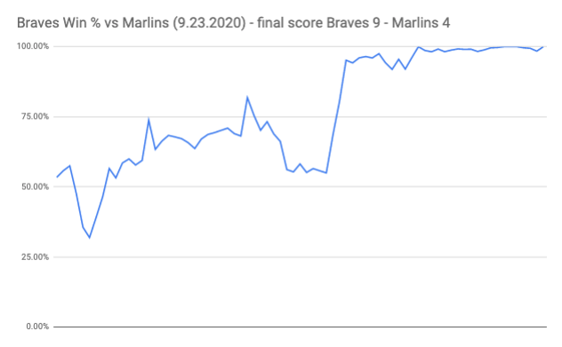
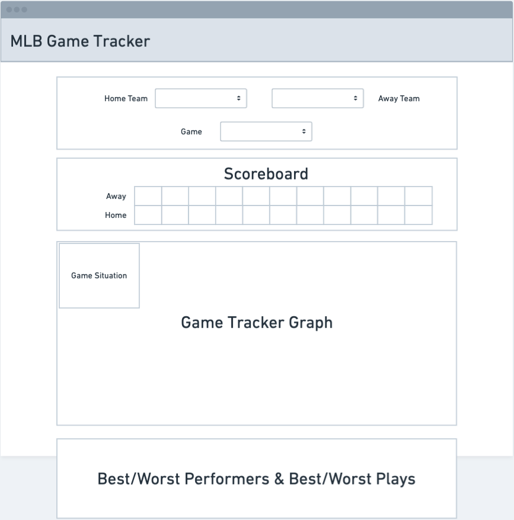

<!-- - [Intro](#intro)
- [Analysis / Data Mining / Planning](#analysis-data-mining-planning)
- [Backend](#backend)
- [Frontend](#frontend)
- [Automation](#automation) -->


## Intro (Day 1)

MLB Game Tracker is a MERN (MongoDB, Express, React, Node.js) project with D3.js for visualizations. This is a project that is many years coming. The inspiration came from a great baseball analytics book called The Book: Playing the Percentages in Baseball. This book covers many topics that are mostly understood by people that follow baseball. Ideas like bunting is almost always a bad idea (same with steals), hot streaks aren't really a thing (neither are cold streaks) and even goes into optimizing your lineup (guess what? The cleanup hitter isn't as important as your little league coach thought). 

Ultimately my goal will be to create a view that allows users to track what the expected runs are for each team compared to the actual number of runs scored. And to give a view into the win probability for each team throughout a game. 

After the site is built, I will work to automate the data export (from bigdataball), data transformation, and data update to MongoDB for the 2021 MLB Season. 

So right now I see this as 4 phases:
1. Analysis / Data Mining / Planning
2. Backend
3. Frontend
4. Automation/Refactor

These are just the first phase steps. I plan to work on this project for a long time. Including more views, different data, different visualizations, etc. 

*** 

<br>

## Analysis, Data Mining, Planning (Day 2 - 3)

### *Find and Explore Data* (Day 2)

This first step of this process was to gather the data and transform it to get the metrics and data points I need. Over the past 2+ years, I have worked to try to find (or scrape) MLB play-by-play data that was free. I have gotten close many times, but I found bigdataball.com and they have play by play data that gets updated each day for a reasonable price (I got 2020 data for ~$35). So I ran with this. The biggest problem with this dataset is that it is an .xlsx file with formatting, so not incredibly machine readable. The two biggest adjustments were transforming the ball and strike columns into 2 ball and strike counter columns and getting rid of any merged cells. After doing that, the file was readable using pandas.read_csv().


Next, I need to add some columns to my datasets. Stuff like runs in current inning and game state (inning + outs + base runners + score difference). I have a Python script that I wrote a couple years ago that I was able to edit and make work for this. It runs pretty slow because I have to calculate the runs till end of inning for each row of data (~190,000 in 2019). I'm planning to go back and refactor that code during the automation phase. 

<br>

### *Get Win % Column* (Day 3)

My next step is to build out the win % columns. This is done in 4 parts:

First, I create a score table to get the winners from each game. I do this by taking the max home score and the max away score for each game and comparing the values. If the home team wins, I set the home team win value to 1; otherwise 0. Taking the average of this column now gives me the home team win % 

```python{numberLines: true}
score = pd.pivot_table(data, 
                            values = ['post_road_score', 'post_home_score'],
                            index = ['dataset', 'game_id'],
                            aggfunc = [np.max])

score = pd.DataFrame(score.to_records())

score.columns = ['dataset', 'game_id', 'final_home_score', 'final_road_score']

home_winner_list = []

for i in range(len(score)):
    if score['final_home_score'][i] > score['final_road_score'][i]:
        home_winner_list.append(1)
    else:
        home_winner_list.append(0)
    
    
score['home_team_win'] = home_winner_list
```

I validated this by checking the results for each season and got the below table. Home teams over the last 5 years have won 53% of games so this checks out. 71% of home teams winning in the 2017 playoffs is pretty crazy.


Next, I joined the 3 columns (final home score, final road score, and home team win) back to the original dataset (data)

```python{numberLines: true}
data = data.merge(score, 
                  on = ['dataset', 
                        'game_id'], 
                  how='left')

data.head()
```

Finally, I created the win % by game state (Base Runners + Outs + Inning + Score Difference) and joined these values back to the main dataset

```python{numberLines: true}
base_out_state_home_win_pct = pd.pivot_table(data, 
                                              values = 'home_team_win', 
                                              index = ['runner_on_1b_ind', 
                                                       'runner_on_2b_ind', 
                                                       'runner_on_3b_ind', 
                                                       'total_outs',
                                                       'inning',
                                                       'home_minus_away_score'], 
                                              aggfunc = [np.mean])

base_out_state_home_win_pct = pd.DataFrame(base_out_state_home_win_pct.to_records())

base_out_state_home_win_pct.columns = ['runner_on_1b_ind', 
                                       'runner_on_2b_ind', 
                                       'runner_on_3b_ind', 
                                       'total_outs', 
                                       'inning', 
                                       'home_minus_away_score',
                                       'home_team_win_pct']

base_out_state_home_win_pct

data = data.merge(base_out_state_home_win_pct, 
                  on = ['runner_on_1b_ind', 
                        'runner_on_2b_ind', 
                        'runner_on_3b_ind', 
                        'total_outs', 
                        'inning', 
                        'home_minus_away_score'], 
                  how='left')
```

Now, I have my win % column. Next step is to check if looking at Win % over time is interesting at all

<br>

### *Visualize* - to validate continuing (Day 3)

I went back to google sheets for this and created two views

First - Home Win % over time



Second - Runs + Expected Runs over time


Both look pretty interesting to me, so I'll keep going with the project. Not sure what the final view will end up being, but I think I'm going to run with Win % for now. There are fewer exceptions to consider and easier to interpret. When talking about data viz, I think both prior points are very important. 

<br>

***

<br>

## Backend (Day 4)

Check out the code here: [backend repo](https://github.com/zashirah/mlb-game-tracker-backend)

This is a MERN project so the database will be MongoDB and an Express backend framework. I built out the backend, set up the MongoDB connection, and deployed the DB through Heroku. When I build this out more in the future, I will include more teams and seasons. 

Version 1 of the backend will be really simple. Just building one table that will house all the data I'm using for the site. You can see the schema below. This was done using Mongoose.

```python{numberLines: true}
const Game = new Schema(
  {
    dataset: { type: String, required: true },
    gameId: { type: String, required: true },
    date: { type: Date, required: true }, 
    inning: { type: String, required: true },
    roadTeam: { type: String, required: true },
    homeTeam: { type: String, required: true },
    roadScore: { type: Number, required: true },
    homeScore: { type: Number, required: true },
    batter: { type: String, required: true },
    batterHand: { type: String, required: true },
    runnerOn1bInd: { type: String, required: true },
    runnerOn2bInd: { type: String, required: true },
    runnerOn3bInd: { type: String, required: true },
    pitcher: { type: String, required: true },
    pitcherHand: { type: String, required: true },
    balls: { type: Number, required: true },
    strikes: { type: Number, required: true },
    hitType: { type: String, required: true },
    playType: { type: String, required: true },
    runs: { type: Number, required: true },
    outs: { type: Number, required: true },
    description: { type: String, required: true },
    startOuts: { type: Number, required: true },
    startingRE: { type: Number, required: true },
    endingRE: { type: Number },
    home_team_win_pct: { type: Number, required: true },
  }
)
```

Eventually, my goal is to build out the backend more. Would like to have something like tables for games, teams, players, seasons, etc. 

<br>

***

<br>

## Frontend (Day 1, 5)

Check out the code here: [Frontend Repo](https://github.com/zashirah/mlb-game-tracker-frontend)

<br>

### *Design Wireframe* (Day 1)



Note: The game situation will come later

<br>

### *Design Component Architecture* (Day 5)


<br>

### *Set Up File & Connect to MongoDB* (Day 5)

I kicked off my frontend with the Gatsby start and cleaned up that file to only include what I need. 

Next, I connected my MongoDB through gatsby-source-mongodb through the following steps:

1. `yarn add gatsby-soure-mongodb`

2. set up configuration in gatsby.config.js
```js{numberLines: true}
{
  resolve: `gatsby-source-mongodb`,
  options: {
    connectionString: `mongodb+srv://zach:<password>@cluster0.rktcu.mongodb.net`,
    dbName: `mlbMongoDB`,
    collection: `games`,
  },
},
```

3. Test the MongoDB connection in the GraphiQL editor


4. Create Graphql query on the GameContainer.jsx component (I added a filter because I don't need to work with all the data now)

```jsx
import React from "react"
import { useStaticQuery, graphql } from "gatsby"

export default function GameContainer() {
  const data = useStaticQuery(graphql`
    query mlbData {
      allMongodbMlbMongoDbGames(filter: {gameId: {eq: "44094-ATL@NYM-1"}}) {
        edges {
          node {
            id
            date
            balls
            batter
            batterHand
            dataset
            description
            endingRE
            gameId
            hitTypes
            homeScore
            homeTeam
            homeTeamWinPct
            inning
            mongodb_id
            outs
            pitcher
            pitcherHand
            playTypes
            roadScore
            roadTeam
            runnerOn1bInd
            runnerOn2bInd
            runnerOn3bInd
            runs
            startOuts
            startingRE
            strikes
          }
        }
      }
    }
  `)

  console.log(data.allMongodbMlbMongoDbGames.edges)

  return <div>hi</div>
}
```


Here are the results of the query. Looks like there were 72 at bats in this game (top left of the picture shows the node count), and I'm showing the details of the first at bat. 


<br>

### *Render Some D3 (with the MLB Data)* (Day 5)

I was slightly concerned about blending D3 and Gatsby (aka React + GraphQL + more) because both React and D3 want to control the DOM. And I haven't used Gatsby and GraphQL in this manner before, but I really enjoy it. 

AND I was able to make it work. It doesn't look like it but the below picture is an actual rendering of the home team win probability for first 8 atbats from a game. I stole the visual from a [D3 + React Udemy course](https://www.udemy.com/course/d3-react/) I took and added my queried data to it. 

It really doesn't look like much but I'm pretty proud of the start. And I got a ton done today.


<br>

### *Create Basic Line Graph with x and y axis and 50% line* (Day 6)

This tracks the home team win percentage (y-axis) each at bat (x-axis). The horizontal line in the middle is the 50% mark so you can tell when the home team vs road team is more likely to win (based on game data from 2016-2020).


Here's the code walk through to create the above (guided by the above Udemy course along with other sites and even more guessing and checking):

#### Step 1. create GameTrackerWrapper.jsx

The GameTrackerWrapper.jsx component is a chart wrapper for the D3Chart. Because both D3 and React want to control the DOM, we need a work around. This [article](https://www.smashingmagazine.com/2018/02/react-d3-ecosystem/) goes through 4 options. I went with the D3 within React method. In this method, we create the chart wrapper file below. The previous article goes into more detail, but the idea is to render a div that references the SVG created by the `GameTrackerChart` class in the `useEffect()`. We also pass the gameData to the GameTrackerChart class.

> Note: The udemy example and code in this article all use class based react, but I wanted to utilize hooks, so I converted everything to hooks.

```jsx
import React, { useRef, useState, useEffect } from "react"
import GameTrackerChart from "./GameTrackerChart"

const ChartWrapper = ({ gameData }) => {
  const chartArea = useRef(null)
  const [chart, setChart] = useState(null)

  useEffect(() => {
    if (!chart) {
      setChart(new GameTrackerChart(chartArea.current, gameData))
    } else {
      chart.update()
    }
  }, [chart])

  return <div className="chart-area" ref={chartArea}></div>
}

export default ChartWrapper
```

#### Step 2. import D3, create global variables, and build D3Chart class (used in the chartWrapper) 

> file name: GameTrackerChart.js

> I'll reference the WIDTH, HEIGHT, and vis throughout the GameTrackerChart.js file

```jsx
import * as d3 from "d3"

const MARGIN = { TOP: 10, BOTTOM: 50, LEFT: 70, RIGHT: 10 }
const WIDTH = 1000 - MARGIN.LEFT - MARGIN.RIGHT
const HEIGHT = 500 - MARGIN.TOP - MARGIN.BOTTOM

export default class D3Chart {
  constructor(element, gameData) {
    let vis = this
    ...
  }
}
```

> all below code steps will go within the constructor

#### Step 3. create blank SVG canvas

```jsx
vis.svg = d3
  .select(element)
  .append("svg")
  .attr("width", WIDTH + MARGIN.LEFT + MARGIN.RIGHT)
  .attr("height", HEIGHT + MARGIN.TOP + MARGIN.BOTTOM)
```

#### Step 4. create and append x and y axis

```jsx
// create y scale
vis.y = d3.scaleLinear()
  .domain([0, 1])
  .range([0, HEIGHT])

// create x scale
vis.x = d3.scaleLinear()
  .domain([0, gameData.length])
  .range([0, WIDTH]

// append y axis
vis.svg.append("g")
  .attr("class", "y axis")
  .call(d3.axisLeft(vis.y)

// append x axis
vis.svg
  .append("g")
  .attr("class", "x axis")
  .call(d3.axisBottom(vis.x))
  .attr("transform", `translate(0, ${HEIGHT})`)
```

#### Step 5. create 50% line

```jsx
vis.svg
  .append("path")
  .datum([...Array(gameData.length).keys()])
  .attr("fill", "none")
  .attr("stroke", "steelblue")
  .attr("stroke-width", 1.5)
  .attr(
    "d",
    d3
      .line()
      .x(function (d) {
        return vis.x(d)
      })
      .y(function (d) {
        return vis.y(0.5)
      })
  )
```

#### Step 6. create line graph of data

> You have to use 1 - d.node.homeTeamWinPct because the values are calculated from top to bottom. So the top of the SVG is y = 0.

```jsx
vis.svg
  .append("path")
  .datum(gameData)
  .attr("fill", "none")
  .attr("stroke", "steelblue")
  .attr("stroke-width", 1.5)
  .attr(
    "d",
    d3
      .line()
      .x(function (d, i) {
        return vis.x(i)
      })
      .y(function (d) {
        return vis.y(1 - d.node.homeTeamWinPct)
      })
  )
```

#### Step 7. create line graph dots

```jsx
vis.svg
  .selectAll(".dot")
  .data(gameData)
  .enter()
  .append("circle")
  .attr("class", "dot")
  .attr("cx", function (d, i) {
    return vis.x(i)
  })
  .attr("cy", function (d) {
    return vis.y(1 - d.node.homeTeamWinPct)
  })
  .attr("r", 3)
  .attr("fill", "steelblue")
```

### *Build update functionaity for D3Chart* (Day 6)

I was able to build out the updating D3 chart. It is really ugly and doesn't have a ton of functionality, but I'm happy I was able to get this to work with the Gatsby + D3 frontend stack. 

Check out the [live site](https://mlbgametracker.netlify.app/) here to mess around with the functionality. You basically click a button and the data updates to reflect the home team win % for each at bat. 

Here's my code for building out the D3 update functionality:

First you have to some of the code from the *Create Basic Line Graph with x and y axis and 50% line* section. Anything that is going to be updated when you change the source data needs to be moved into the update function. This includes the following: x-axis, 50% line (needs the x axis to work), the line chart, and the dots. 

The contstructure function now looks like this:
```jsx
constructor(element, gameData) {
  let vis = this
  // create svg canvas
  vis.svg = d3
    .select(element)
    .append("svg")
    .attr("width", WIDTH + MARGIN.LEFT + MARGIN.RIGHT)
    .attr("height", HEIGHT + MARGIN.TOP + MARGIN.BOTTOM)
  // create y axis
  vis.y = d3.scaleLinear().domain([0, 1]).range([0, HEIGHT])
  // create x axis
  // vis.x = d3.scaleLinear().domain([0, gameData.length]).range([0, WIDTH])
  // append y axis
  vis.svg.append("g").attr("class", "y axis").call(d3.axisLeft(vis.y))
  // create x axis group
  vis.xAxisGroup = vis.svg.append("g")
  // call update()
  vis.update(gameData)
}
```

And we moved the x-axis and 50% line to the update function like so:
```jsx
update(data) {
  const vis = this
  // create x axis
  const x = d3.scaleLinear().domain([0, data.length]).range([0, WIDTH])
  // append x axis
  const xAxisCall = d3.axisBottom(x)
  vis.xAxisGroup
    .transition()
    .duration(500)
    .call(xAxisCall)
    .attr("transform", `translate(0, ${HEIGHT})`)
    .transition()
    .duration(500)
  // 50% line
  vis.svg
    .append("path")
    .datum([...Array(data.length).keys()])
    .attr("fill", "none")
    .attr("stroke", "steelblue")
    .attr("stroke-width", 1.5)
    .attr(
      "d",
      d3
        .line()
        .x(function (d) {
          return x(d)
        })
        .y(function (d) {
          return vis.y(0.5)
        })
    )
...
}
```

Then we need to build out the EXIT, UPDATE, and REMOVE functionality.

Here's the code for the lines:
```jsx
// UPDATE THE LINES
// DATA JOIN
const lines = vis.svg.selectAll(".pathLine").data(data
// EXIT
lines
  .exit()
  .transition()
  .duration(500)
  .attr("height", 0)
  .attr("y", HEIGHT)
  .remove(
// UPDATE
lines
  .transition()
  .duration(500)
  .attr(
    "d",
    d3
      .line()
      .x((d, i) => x(i))
      .y(d => vis.y(1 - d.node.homeTeamWinPct))
  
// append path, bind data, call generator
vis.svg
  .datum(data)
  .append("path")
  .transition()
  .duration(500)
  .attr("class", "pathLine")
  .attr("fill", "none")
  .attr("stroke", "steelblue")
  .attr("stroke-width", 1.5)
  .attr(
    "d",
    d3
      .line()
      .x((d, i) => x(i))
      .y(d => vis.y(1 - d.node.homeTeamWinPct))
  )
```

> Note: I'm struggling with getting the lines to update correct. They are just disappearing and reappearing instead of moving like the dots are. I'll return to this after adding more functionality.

Here's the code for the dots:
```jsx
// UPDATE THE DOTS
// DATA JOIN
const dots = vis.svg.selectAll(".dot").data(data
// EXIT
dots
  .exit()
  .transition()
  .duration(500)
  .attr("height", 0)
  .attr("y", HEIGHT)
  .remove(
// UPDATE
dots
  .transition()
  .duration(500)
  .attr("cx", (d, i) => x(i))
  .attr("cy", d => vis.y(1 - d.node.homeTeamWinPct))
  .attr("r", 3
// select dots class, bind data, appendcircles
dots
  .enter()
  .append("circle")
  .attr("class", "dot")
  .attr("cx", (d, i) => x(i))
  .attr("cy", d => vis.y(1 - d.node.homeTeamWinPct))
  .attr("r", 3)
  .attr("fill", "steelblue")
```


<br> 

***

<br>

## Automation

Notes of needed fixes:
- post score (home and away)
- winning team (needs to use post score)


